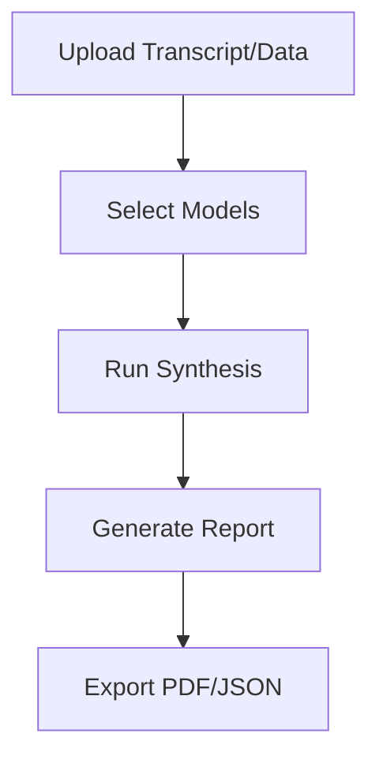

## Overview

Cercle IA combines multiple AI models into one platform, enabling you to compare responses from ChatGPT, Claude, Gemini, Perplexity, and Mistral side-by-side. Access prompt libraries, bookmark conversations, build agents, and synthesize complex data like meetings or market reports efficiently.

<Callout kind="info">
Cercle IA supports over 20 models across providers, with Private GPT options for confidential data processing.
</Callout>

## Key Features

<Columns cols={2}>
  <Card title="Prompt Library" icon="library" href="#prompt-library">
    Reuse pre-built templates for common tasks like analysis and code generation.
  </Card>
  <Card title="Conversation Bookmarks" icon="bookmark" href="#bookmarks">
    Save and organize chats for quick reference and sharing.
  </Card>
  <Card title="Custom AI Agents" icon="bot" href="#agents">
    Create tailored agents combining multiple models.
  </Card>
  <Card title="Data Synthesis" icon="trending-up" href="#synthesis">
    Generate insights from meetings and market data automatically.
  </Card>
</Columns>

## Using the Prompt Library

Access reusable templates to streamline your workflows.

<Steps>
  <Step title="Browse Library" icon="search">
    Navigate to the prompt library in the sidebar.
  </Step>
  <Step title="Select Template" icon="file-text">
    Choose from categories like "Analysis" or "Research".
  </Step>
  <Step title="Customize and Run" icon="play">
    Edit variables and execute across multiple models.
  </Step>
</Steps>

```javascript
// Example prompt template usage (JSON config)
{
  "template": "Analyze this market data: {data}",
  "models": ["gpt-4o", "claude-3", "gemini-pro"],
  "variables": {
    "data": "Sales Q1: 150k EUR"
  }
}
```

<Expandable title="Advanced Variables" default-open="false">
Use dynamic placeholders like `{current_date}` or `{user_input}` for flexible templates.
</Expandable>

## Saving and Bookmarking Conversations

Organize your interactions for future use.

<Tabs>
  <Tab title="Web App" icon="monitor">
    Click the bookmark icon next to any conversation to save it to your library.
  </Tab>
  <Tab title="API Integration" icon="code">
    ```javascript
    await fetch('https://api.cercle-ia.com/v1/bookmarks', {
      method: 'POST',
      headers: { 'Authorization': 'Bearer YOUR_API_KEY' },
      body: JSON.stringify({
        conversation_id: 'conv_123',
        title: 'Market Analysis Q1'
      })
    });
    ```
  </Tab>
</Tabs>

## Building Custom AI Agents

Combine models into specialized agents.

<CodeGroup tabs="JavaScript,Python">
  ```javascript
  const agent = cercleIA.createAgent({
    name: 'Research Agent',
    models: ['perplexity', 'mistral'],
    instructions: 'Focus on factual research with sources.'
  });
  const response = await agent.query('Latest AI trends');
  ```
  ```python
  agent = cercle_ia.create_agent(
    name="Research Agent",
    models=["perplexity", "mistral"],
    instructions="Focus on factual research with sources."
  )
  response = agent.query("Latest AI trends")
  ```
</CodeGroup>

## Synthesizing Meetings and Market Analysis

Automate insight generation from raw data.



<Callout kind="tip">
For best results, use Private GPT models with sensitive meeting data to ensure confidentiality.
</Callout>

| Feature | Supported Inputs | Output Formats |
|---------|------------------|----------------|
| Meetings | Audio transcripts, notes | Summary, action items |
| Market Analysis | CSV data, reports | Trends, forecasts |

<Columns cols={2}>
  <Card title="Next: Quickstart" icon="rocket" href="/quickstart">
    Set up your first project.
  </Card>
  <Card title="API Reference" icon="api" href="/authentication">
    Integrate programmatically.
  </Card>
</Columns>