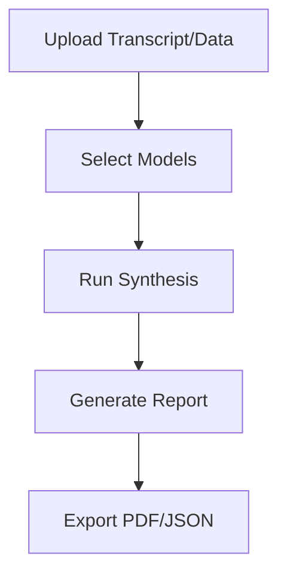

## Vue d’ensemble

Cercle IA combine plusieurs modèles d’IA au sein d’une seule plateforme, vous permettant de comparer côte à côte les réponses de ChatGPT, Claude, Gemini, Perplexity et Mistral. Accédez à des bibliothèques de prompts, ajoutez des conversations aux favoris, créez des agents et synthétisez efficacement des données complexes comme des réunions ou des rapports de marché.

<Callout kind="info">
Cercle IA prend en charge plus de 20 modèles auprès de différents fournisseurs, avec des options de Private GPT pour le traitement confidentiel de vos données.
</Callout>

## Fonctionnalités clés

<Columns cols={2}>
  <Card title="Bibliothèque de prompts" icon="library" href="#prompt-library">
    Réutilisez des modèles préconfigurés pour les tâches courantes comme l’analyse et la génération de code.
  </Card>
  <Card title="Conversations en favoris" icon="bookmark" href="#bookmarks">
    Enregistrez et organisez vos discussions pour les retrouver et les partager facilement.
  </Card>
  <Card title="Agents d’IA personnalisés" icon="bot" href="#agents">
    Créez des agents sur mesure en combinant plusieurs modèles.
  </Card>
  <Card title="Synthèse de données" icon="trending-up" href="#synthesis">
    Générez automatiquement des insights à partir de réunions et de données de marché.
  </Card>
</Columns>

## Utiliser la bibliothèque de prompts

Accédez à des modèles réutilisables pour optimiser vos flux de travail.

<Steps>
  <Step title="Parcourir la bibliothèque" icon="search">
    Accédez à la bibliothèque de prompts via la barre latérale.
  </Step>
  <Step title="Sélectionner un modèle" icon="file-text">
    Choisissez parmi des catégories comme "Analyse" ou "Recherche".
  </Step>
  <Step title="Personnaliser et exécuter" icon="play">
    Modifiez les variables et exécutez le prompt sur plusieurs modèles en parallèle.
  </Step>
</Steps>

```javascript
// Exemple d’utilisation d’un modèle de prompt (configuration JSON)
{
  "template": "Analyze this market data: {data}",
  "models": ["gpt-4o", "claude-3", "gemini-pro"],
  "variables": {
    "data": "Sales Q1: 150k EUR"
  }
}
```

<Expandable title="Variables avancées" default-open="false">
Utilisez des espaces réservés dynamiques comme `{current_date}` ou `{user_input}` pour rendre vos modèles plus flexibles.
</Expandable>

## Enregistrer et ajouter des conversations aux favoris

Organisez vos interactions pour pouvoir les réutiliser plus tard.

<Tabs>
  <Tab title="Application web" icon="monitor">
    Cliquez sur l’icône de favori à côté de n’importe quelle conversation pour l’enregistrer dans votre bibliothèque.
  </Tab>
  <Tab title="Intégration API" icon="code">
    ```javascript
    await fetch('https://api.cercle-ia.com/v1/bookmarks', {
      method: 'POST',
      headers: { 'Authorization': 'Bearer YOUR_API_KEY' },
      body: JSON.stringify({
        conversation_id: 'conv_123',
        title: 'Market Analysis Q1'
      })
    });
    ```
  </Tab>
</Tabs>

## Créer des agents d’IA personnalisés

Combinez plusieurs modèles dans des agents spécialisés.

<CodeGroup tabs="JavaScript,Python">
  ```javascript
  const agent = cercleIA.createAgent({
    name: 'Research Agent',
    models: ['perplexity', 'mistral'],
    instructions: 'Focus on factual research with sources.'
  });
  const response = await agent.query('Latest AI trends');
  ```
  ```python
  agent = cercle_ia.create_agent(
    name="Research Agent",
    models=["perplexity", "mistral"],
    instructions="Focus on factual research with sources."
  )
  response = agent.query("Latest AI trends")
  ```
</CodeGroup>

## Synthétiser des réunions et des analyses de marché

Automatisez la génération d’insights à partir de données brutes.



<Callout kind="tip">
Pour de meilleurs résultats, utilisez des modèles Private GPT avec des données de réunion sensibles afin de garantir la confidentialité.
</Callout>

| Fonctionnalité | Entrées prises en charge | Formats de sortie |
|----------------|--------------------------|-------------------|
| Réunions | Transcriptions audio, notes | Résumé, points d’action |
| Analyse de marché | Données CSV, rapports | Tendances, prévisions |

<Columns cols={2}>
  <Card title="Ensuite : démarrage rapide" icon="rocket" href="/fr/quickstart">
    Configurez votre premier projet.
  </Card>
  <Card title="Référence API" icon="api" href="/authentication">
    Intégrez la plateforme par programmation.
  </Card>
</Columns>